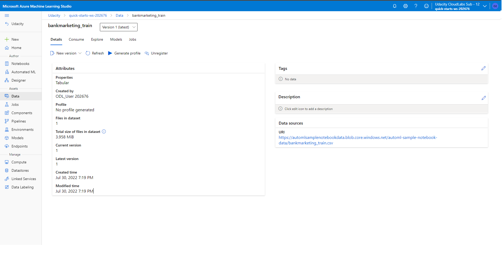
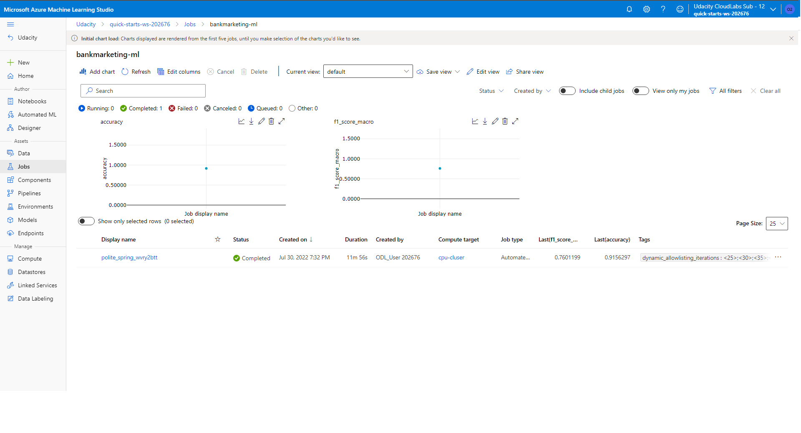
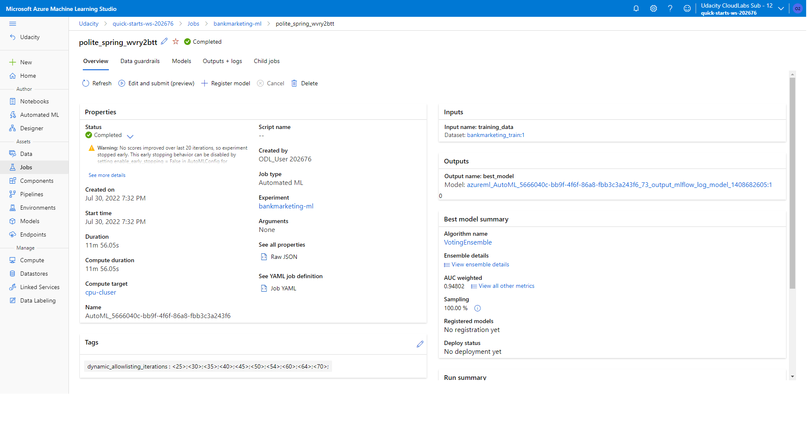
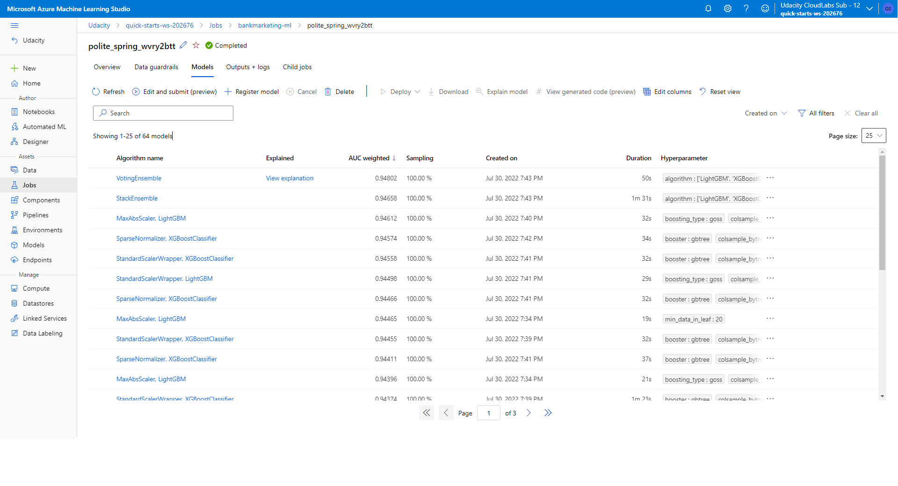

# Project: Operationalizing Machine Learning
## Overview	
This project is part of the Udacity Azure ML Nanodegree. The objective of this project is to configure a cloud-based machine learning production model, deploy it, and consume it and create automated process creating, publishing and consuming a pipeline.	

## Architectural Diagram

## Key Steps
### Step 1: Authentication
- When work with Az labs, authentication not need
- When work on notebook to create pipeline, 1 authentication step is need
### Step 2: Automated ML Experiment
- Create data set

- Create Auto ML

### Step 3: Deploy the Best Model
- Best model

- Deploy best model

### Step 4: Enable Log

- Turn on Application_Insights

- Endpoint log

### Step 5: Create, Publish and Consume a Pipeline

### Step 6: Document
- Swagger Serve

- Swagger document

## Screen Recording
1. Create AutoML
	- [Best-model-deploy](../sample_screenshots/Best-model-deploy.mp4)
		+ Start deploy best model after train model comple
	- [Best-model-deployed-endpoint-running](../sample_screenshots/Best-model-deployed-endpoint-running.mp4)
		+ Deploy best model compl
		+ Run endpoit.py
		+ Run benchmark.sh
		
2. Pipeline
	- [Pipeline-Start](../sample_screenshots/Pipeline-Start.mp4)
		+ Config and publish pipeline
		
	- [Pipeline-running-completed-Publish-endpoint](../sample_screenshots/Pipeline-running-completed-Publish-endpoint.mp4)
		+ Pipeline run com
		+ Output best model
		+ Publish API Endpoint
		
## Standout Suggestions
